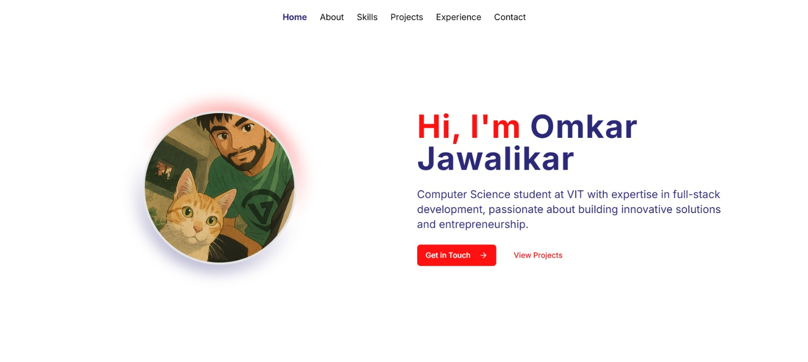

# 🌐 Portfolio 2.0

A modern, responsive, and accessible developer portfolio built using **Next.js 13**, **TypeScript**, and **Tailwind CSS**.

## 🚀 Live Demo

🔗 Check it out here: [portfolio-2-0-seven-theta.vercel.app](https://portfolio-2-0-seven-theta.vercel.app)

## 🧱 Tech Stack

- **Framework**: Next.js 13 (App Router)
- **Language**: TypeScript
- **Styling**: Tailwind CSS
- **Package Manager**: pnpm
- **Build Tools**: PostCSS
- **Deployment**: Vercel

## ✨ Features

- ⚡ Blazing fast performance with static site generation
- 📱 Responsive design for all screen sizes
- 🧑‍💻 Developer-friendly folder structure
- 🧩 Modular and reusable components
- 🌙 Dark mode support ( upcoming feature..)
- 🔍 SEO-friendly with customizable meta tags

## 📁 Folder Structure

```
app/          → Routes & pages  
components/   → Reusable UI pieces (buttons, headers, etc.)  
hooks/        → Custom React logic  
lib/          → Utility functions  
public/       → Static files (images, favicons, etc.)  
styles/       → Global CSS  
.vscode/      → Editor settings  
```

## 📸 Screenshots




## 🛠️ Getting Started

### Prerequisites

- [Node.js](https://nodejs.org/) (v16 or newer)
- [pnpm](https://pnpm.io/) (v7 or newer)

### Installation

```bash
# Clone the repository
git clone https://github.com/Falcon-J/Portfolio_2.0.git
cd Portfolio_2.0

# Install dependencies
pnpm install

# Run the development server
pnpm dev

# Build for production
pnpm build
```

## 🪪 License

This project is licensed under the [MIT License](LICENSE).

---

> Crafted with ❤️ by [Falcon-J](https://github.com/Falcon-J)

